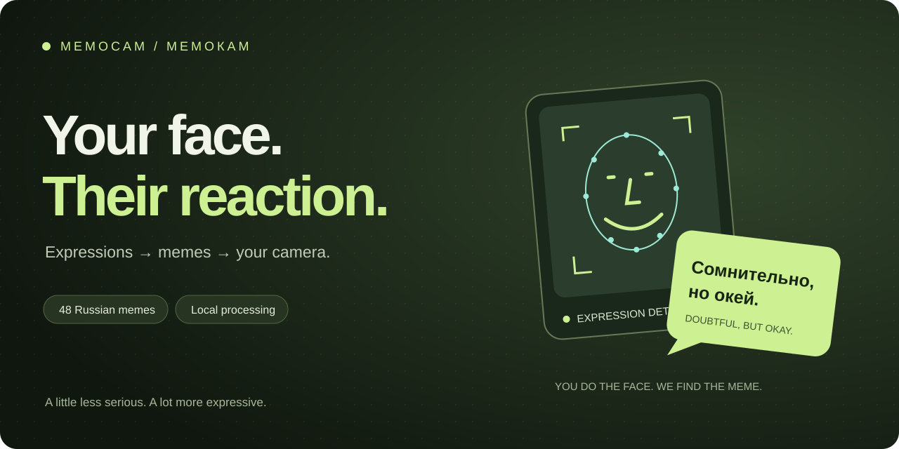
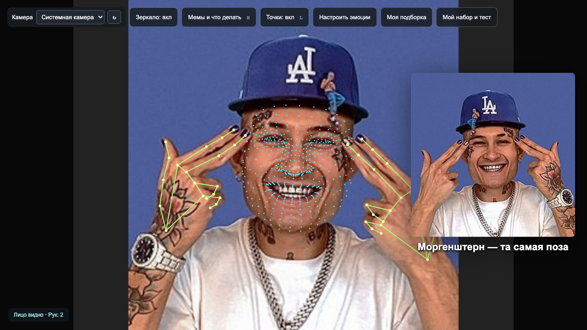
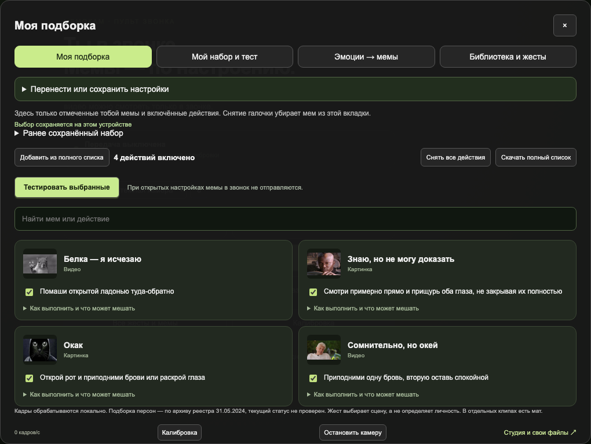
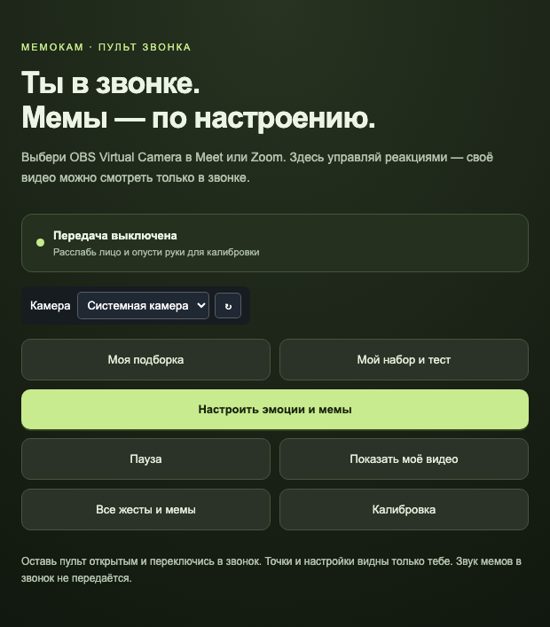

<p align="center"><strong>Русский</strong> · <a href="README.en.md">English</a></p>



<p align="center">
  <a href="https://github.com/vboldyrev16/memocam/actions/workflows/checks.yml"></a>
  <a href="LICENSE"></a>
  <a href="https://nodejs.org/"></a>
</p>

# Твоё выражение лица → мем в звонке

**Мемокам** — камера, которая реагирует на твои жесты и мимику. Приподними бровь — появится «Сомнительно, но окей». Помаши рукой — белка исчезнет вместо тебя. Собери свою подборку из **48 мемов российского интернета**, проверь жесты и отправляй реакции в Meet или Zoom через OBS.

Без аккаунта. Кадры обрабатываются локально в браузере. Интерфейс и мемы — на русском; документация доступна на [английском](README.en.md).

[Быстрый запуск](#быстрый-запуск) · [Как это выглядит](#как-это-выглядит) · [В звонке](#в-звонке) · [Помочь проекту](CONTRIBUTING.md)

## Как это выглядит



*Настоящее распознавание MediaPipe на публичном изображении из каталога, поданном как тестовая камера. Это демонстрация работы приложения, не запись пользователя.*

| Твоё действие | Реакция |
|---|---|
| Открытый рот + поднятые брови или раскрытые глаза | Окак |
| Одна бровь выше другой | Сомнительно, но окей |
| Прищур обоих глаз | Знаю, но не могу доказать |
| Ладонь у щеки + открытый рот | Тиньков с папкой и языком |
| Взмах раскрытой ладонью туда-обратно | Белка — я исчезаю |

**Выбираешь ты.** Можно включить только любимые действия, назначить другой мем выражению лица и загрузить собственный файл. Приложение сопоставляет видимые движения с реакциями — внутренние эмоции и личность человека оно не определяет.

## Быстрый запуск

Нужны **Node.js 22.12+**, Git и современный Chrome/Chromium. Ручная проверка проводилась на macOS; другие системы пока не проверены вручную.

```sh
git clone https://github.com/vboldyrev16/memocam.git
cd memocam
npm ci
npm run setup
npm run dev
```

Открой **http://127.0.0.1:5173**, разреши камеру и на две секунды расслабь лицо. В списке **«Камера»** можно выбрать внешнюю веб-камеру; выбор запомнится.

`setup` скачивает две модели с проверкой SHA-256 и устанавливает WASM из npm-пакета. Для установки нужен интернет; распознавание кадров выполняется на твоём устройстве. Готового подписанного установщика пока нет.

## Твоя подборка



1. **«Мой набор и тест»** — отметь пары «мем — действие».
2. **«Моя подборка»** — открой только выбранное, без поиска по каталогу.
3. **«Тестировать выбранные»** — посмотри условия распознавания, точки и журнал срабатываний.
4. **«Перенести или сохранить настройки»** — сохрани JSON или импортируй подборку с другого устройства.

Текущий выбор сохраняется автоматически. Импорт применяется после просмотра и подтверждения. Свои медиа добавляй через студию `/?studio=1`; они хранятся в браузере и не входят в экспорт настроек.

<details>
<summary>Клавиши, зеркальность и повторные попытки</summary>

- **H** — библиотека; **L** — точки; **пробел** — пауза; **F** — полный экран.
- **«Зеркало: вкл/выкл»** меняет только личный предпросмотр Мемокам, а не Google Meet.
- Для повторной реакции верни нейтральное выражение и опусти руки. Белка доигрывает около семи секунд.
- Для скепсиса, прищура и пальца у переносицы держи лицо примерно прямо.
- После смены камеры повторяется калибровка. Если устройство пропало, нажми **↻** или выбери другую камеру.

</details>

## В звонке

**Камера → Мемокам → OBS Virtual Camera → Meet / Zoom**



1. Установи [OBS Studio](https://obsproject.com/). На macOS разреши расширение камеры, если OBS попросит.
2. Открой `http://127.0.0.1:5173/?send=1&compact=1` — компактный пульт.
3. В OBS добавь **Browser Source**: `http://127.0.0.1:5173/?output=1`, размер **1280×720**. Для сцены и выхода также используй 1280×720.
4. Нажми **Start Virtual Camera**, затем выбери **OBS Virtual Camera** в Meet/Zoom.

В звонок идёт чистый кадр без точек и кнопок. **«Кадр для звонка ↗»** показывает исходящий поток до дополнительной обработки OBS/Meet. Камера заполняет 16:9 с обрезкой лишнего по краям; мем сохраняет пропорции.

**Ограничения:** вкладку Мемокам нужно оставить работающей; звук мемов не передаётся в микрофон. Во время настройки новые тестовые реакции не отправляются в звонок. Освещение, ракурс и перекрытые кисти влияют на распознавание. [Диагностика жестов →](docs/RECOGNITION.md)

## Что внутри

React · TypeScript · Vite · MediaPipe · Web Worker

```sh
npm test
npm run build
npx playwright install chromium
npm run test:e2e
```

[Правила участия](CONTRIBUTING.md) · [История изменений](CHANGELOG.md) · [Сообщить об ошибке](https://github.com/vboldyrev16/memocam/issues/new/choose)

Подсказки по коду и авторскому набору — в [CONTRIBUTING.md](CONTRIBUTING.md). Передача в OBS использует локальный сервер Vite: статический GitHub Pages не заменяет сервер звонков.

## Мемы, источники и лицензии

Код — [MIT](LICENSE). В комплекте 48 мемов с изображениями, GIF, аудио и видео; источники перечислены в [sources.json](public/media/sources.json). **MIT не распространяется на сторонние медиа; отдельные разрешения на их распространение не подтверждены.** [Условия компонентов и материалов](THIRD_PARTY.md).

Для удаления материала или исправления источника открой issue с названием файла и ссылкой на оригинал. Категории персон в каталоге не являются проверкой текущего правового статуса. В отдельных клипах есть ненормативная лексика.
